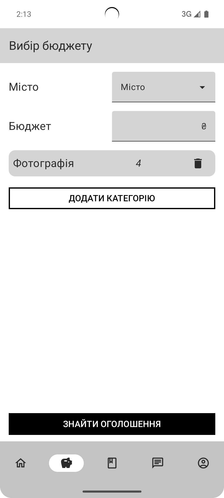
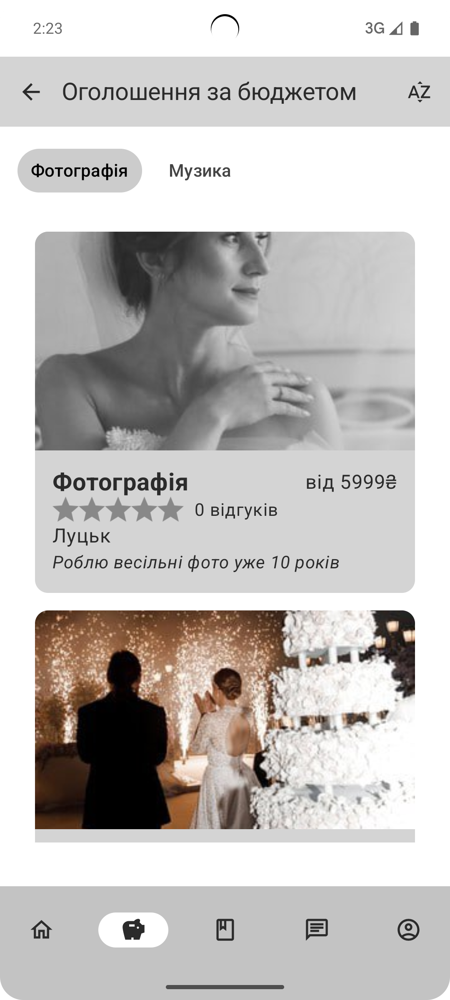
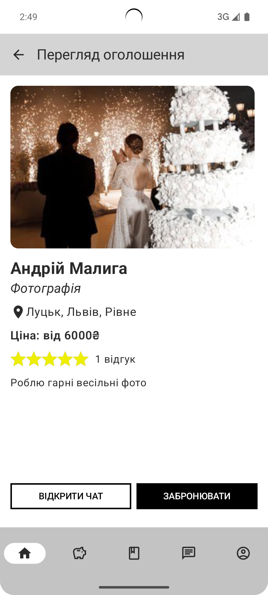
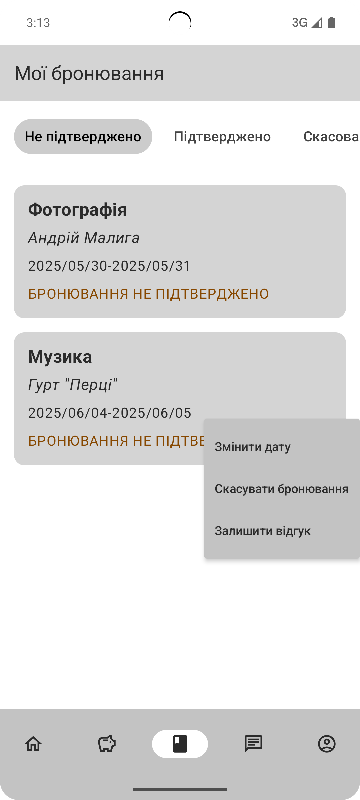
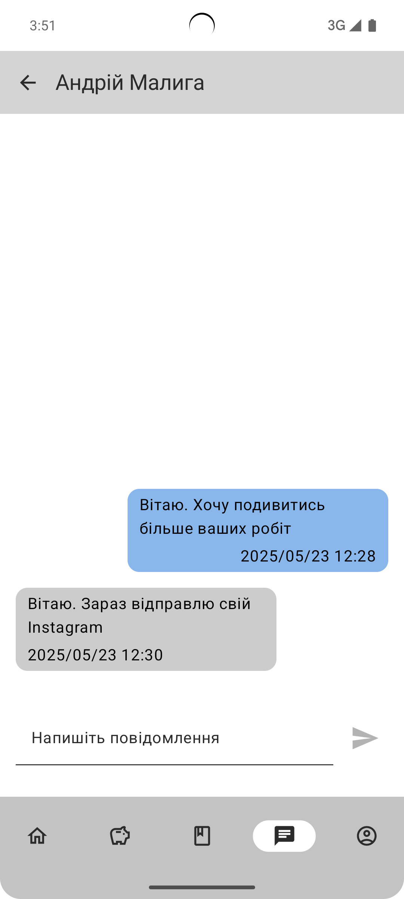
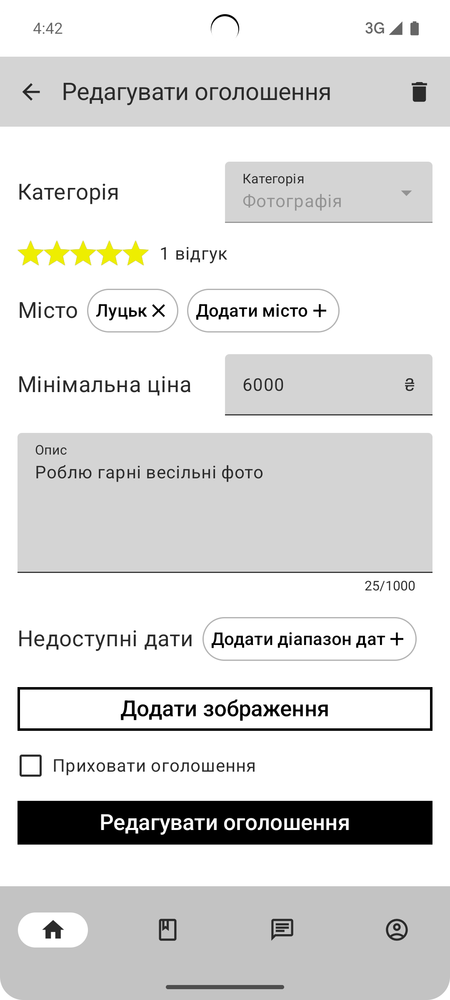

# Zeit zu heiraten
## Android app for posting and booking wedding services

This app helps simplify the wedding preparation process by providing functionality for booking services and selecting posts based on the 
wedding budget.

## Technologies
* Kotlin
* Jetpack Compose
* Hilt
* Coroutines
* View Model
* Clean Architecture
* Firebase: Auth, Firestore, Storage, Functions

## Main Functionality

1. **Main customer screen:**
   Displays wedding services based on category, city and max price.

   

      
   

2. **Posts with budget:**
   Displays wedding services based on chosen wedding budget, city, categories and their weights.

   

      
      &nbsp;&nbsp;&nbsp;
      
   

3. **Post view:**
   Displays post. On this page user can book the service on chosen date.

   

      
   

4. **My bookings:**
   Displays user's bookings. On this page user can change booking date, confirm or cancel booking and leave a feedback.

   

      
   

5. **Chat:**
   Displays chat. On this page users can send and view messages.

   

      
   

6. **Edit post:**
   On this page provider can edit the post. The post contains category, cities, min price, description, unavailable dates and images.

   

      
   

App icon by [smashingstocks](https://www.flaticon.com/authors/smashingstocks) from [Flaticon](https://www.flaticon.com/free-icon/wedding-ring_5195952)
